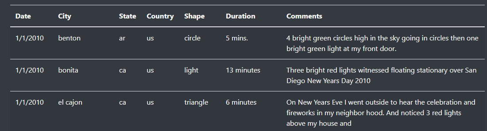
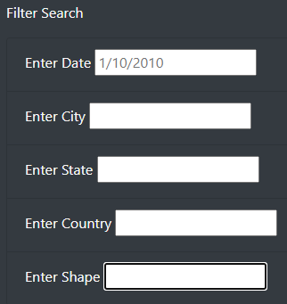
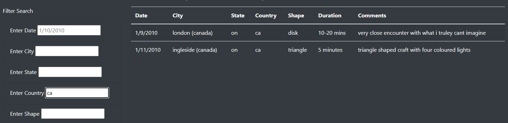

# UFOs

## Purpose
Data journalism is an area where Dana wants to combine her interest in UFO sightings, revisit her hometown and display this information to others. She is hoping that this project will allow her to leverage her analytical skills and showcase her results in a tidy HTML format with easy ways to interact with and filter the data. 

## Results
When someone arrives on Dana's page, we can see the static information across the top with the background images and context information. Below this information, users will see a table like below:
 

This table initially shows all the information which Dana has gathered in the background, but what if the user wants to see something specific? for this, we have added Filters where a user can select a particular date, city, state, country, shape of all sightings. 

To use these filters, a user will enter the specific information and hit enter, then the table will be filtered accordingly:

## Summary
### Drawback
The page is quite intuitive for users to enter their filters, however since we removed the button a user must hit 'enter' for the filters to be applied. This might not be obvious to every user of the page and it could result in some frustrations from users if they do not understand how this works. In the worst scenario, the user could think the page is broken.

### Recommendations for future developments
1. First recommendation would be to add back the button and this would then be clear for users to hit this button to filter the data without any confusion.
2. Upgrade the filter code so that any filters added are dynamically updated on the table once the user clicks out of the field. 